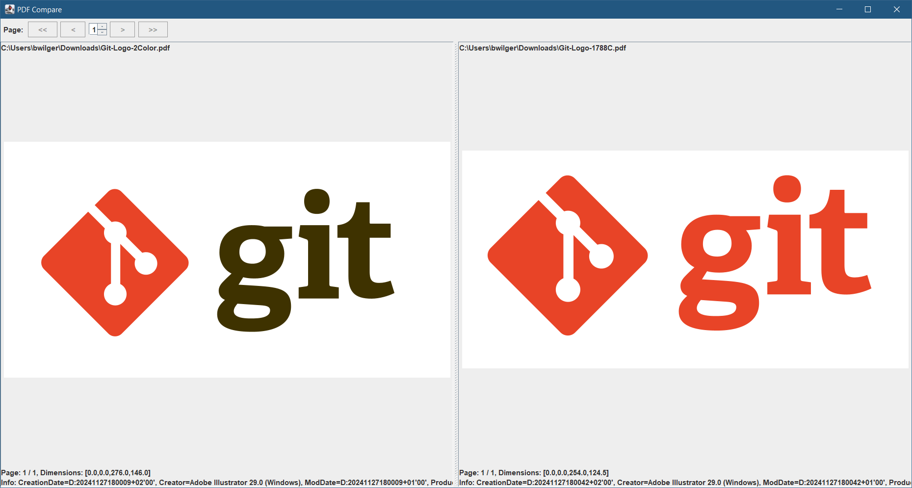

# jpdfdiff

Silly and simple PDF side-by-side viewer which offers:

- simple Pagination
- page content is scaled down/up to render it into the bounding box

It currently cannot highlight any differences. It literally just shows both files side by side.

Uses [Apache PDFBox](https://github.com/apache/pdfbox) for rendering PDF files.

## Usage

Build with maven

````
mvn package
````

Run without arguments (opens two file choosers):

````
java -jar pdf-compare-1.0-SNAPSHOT.jar
````



## TortoiseSVN / VCS integration

To enable the tool for viewing changed pdf files in your commit dialog you can configure
a special diff viewer for `.pdf` files:


With other VCS clients there should be a similar way to integrate a special diff tool.